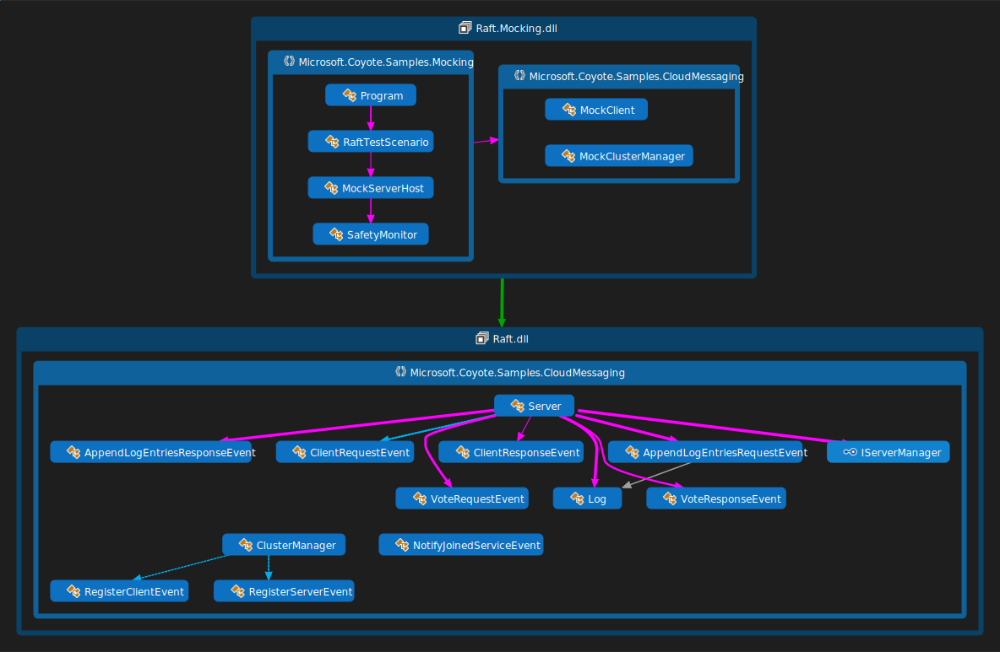

## Azure Mocking Example

In the [previous example](raft-azure) you created an Azure application that uses Coyote
and performs messaging using an [Azure Service Bus](https://azure.microsoft.com/en-us/services/service-bus/).  This is a great way to build
a reliable business application.  But there is overhead in using an enterprise scale
service bus, which limits our ability to fully test the state machine.

In this example you will `mock` the Azure Service Bus which allows the [Coyote tester](/coyote/learn/tools/testing)
to perform thousands of tests per second and thereby find bugs in the application code more efficiently.

## What you will need

You will also need to:
- Install [Visual Studio 2019](https://visualstudio.microsoft.com/downloads/).
- Build the [Coyote project](/coyote/learn/get-started/install) and in the build output find the netcoreapp2.2 version of `coyote.dll`.
This will live in a path like this: `c:\git\coyote\bin\netcoreapp2.2\coyote.dll`.  Set this path in a new environment variable named `coyote`
- Clone the [Coyote Samples git repo](http://github.com/microsoft/coyote-samples).


## Build the Samples

Build the `coyote-samples` repo by running the following command:

```
powershell -f build.ps1
```

## Run the Raft.Mocking application

Now you can run `coyote test` tool on the Raft.Mocking application:

```shell
dotnet %coyote% test ./bin/netcoreapp2.2/Raft.Mocking.dll -i 1000 -ms 200
```

Notice because of the mocking of Azure API's this application is now able to run 200 steps per iteration and a thousand
iterations pretty quickly, much faster than if all those messages were going to Azure and back.  This means the test
can quickly explore every kind of asynchronous timing of events to find all the bugs.  Not only is it faster but it is
also systematic in how it explores every possible interleaving of asynchronous operations.  This systematic approach ensures
the test doesn't just test the same happy paths over and over (like a stress test does) but instead it is more likely to
find one bad path where a bug is hiding.

You can now play with other test parameters like `--graph` to see a [DGML diagram](/coyote/learn/tools/dgml) of all
the messages sent during the test.
You can browse these graphs using Visual Studio.

## Design

 The following diagram illustrates how the `MockClient` actor sends `ClientRequestEvents`, and how the `MockClusterManager` subclasses
 from `ClusterManager`. There is also a `MockServerHost` that implements the `IServerManager` interface and a `RaftTestScenario`
 class which sets everything up:

 

This mock test setup is able to fully test the `Server` implementation and get good coverage.

The test also include a coyote `Monitor`
called `SafetyMonitor` which provides a global invariant check, namely checking there is never more than one `Server` that is
elected to be the `Leader` at the same time.  The `Monitor` class in Coyote shows how to inject additional work that you want
to do at test time only, and have almost no overhead in the production code.

The way this works is that the Coyote `ProductionRuntime` checks the mode it is in and bypasses the creation of `Monitor` classes
when in production mode:

```c#
        internal override void TryCreateMonitor(Type type)
        {
            // Check if monitors are enabled in production.
            if (!this.Configuration.EnableMonitorsInProduction)
            {
                return;
            }
            ...
```
