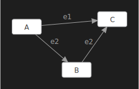

## Actor semantics

An `Actor` in Coyote is an in-memory object. The main APIs that define the semantics of programming
with actors are `CreateActor`, which is used to create a new `Actor` instance, and `SendEvent` that
is used to pass an event to an existing `Actor`. It is useful to understand both the synchronous and
asynchronous guarantees of these methods.

## Semantics of actor creation

Suppose you create an `Actor` as follows:

```c#
ActorId clientId = this.CreateActor(typeof(Client));
```

This call synchronously creates the inbox of the actor. The initialization of the new actor happens
asynchronously in the background. Think of this as follows: the call takes only as long as it takes
to create an inbox. It does not wait for the initialization code of the target actor to finish. This
is enough to guarantee that you can start sending messages to the new actor immediately after
creating it. Basically, if you have an `ActorId`, then you can send messages to it. The Coyote
runtime will initialize the new actor in the background, and ensure that its initialization finishes
before letting the actor process its inbox.

## Semantics of actor messages

Actors in Coyote have both in-order as well as causal-delivery semantics. Lets break down this
guarantee into pieces. If one actor sends two messages to another actor as follows:

```c#
this.SendEvent(id, e1);
this.SendEvent(id, e2);
```

Then it is guaranteed that `e1` will be delivered to the inbox of `id` before `e2`. This is the
_in-order_ part of the message-delivery semantics. To explain causal delivery, we need to consider
three actors `A`, `B` and `C`. Suppose that `A` first sends a message `e1` to `C` and then it sends
a message `e2` to `B`. Next, `B` is programmed so that whenever it receives a message `e2`, it will
forward it to `C`.



For this program, the message `e1` is guaranteed to reach the inbox of `C` before
`e2`. There is a simple way of thinking about this guarantee. The call to `SendEvent` ensures that
the message is delivered to the inbox of the target before it returns. (It does not wait for the
message to be processed---that can happen asynchronously.) Thus, when `A` sent message `e1` to `C`,
it was delivered to the inbox of `C` even before the message `e2` was sent out. Thus, `e2` had no
chance of _overtaking_ `e1` to reach the inbox of `C` first.

## Distributed systems modeling

Suppose that you have written a distributed system where each node of the system is running its own
set of Coyote actors and these actors communicate over the network. When you write a Coyote test for
checking end-to-end behaviors (by using a mock of the network to connect all the remote nodes
together in the same test), then be sure to consider the difference in the delivery semantics of the
network and the Coyote API `SendEvent`. Usually, real networks will provide more relaxed guarantees
than `SendEvent` for performance reasons. Closing this gap requires modeling. For instance, a
network that can either lose a message, deliver it once, or deliver it twice can be modeled as
follows:

```c#
if(this.Random())
{
   this.SendEvent(destination, message);
}
if(this.Random())
{
   this.SendEvent(destination, message);
}
```

See also [State machine semantics](state-machines.md#precise-semantics).
