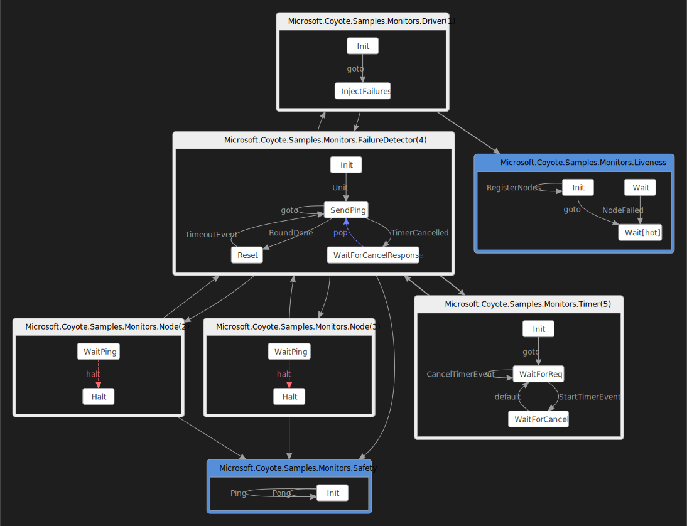

## Using Coyote

As shown in the [overview](../index.md), there are two main ways to use Coyote.
The simplest is to use the [asynchronous tasks](../programming-models/async/overview.md) and the
more advanced way is using the [asynchronous actors](../programming-models/actors/overview.md).

**Note:** If you are upgrading to Coyote from P#, see [upgrading from
P#](upgrade-from-psharp.md).

Assuming you have [installed Coyote](install.md) and built the samples, you
are ready to use the `coyote` command line tool. In your [Coyote
samples](http://github.com/microsoft/coyote-samples) local repo you can find the compiled binaries
in the `bin` folder.  Here we assume you are using the [.NET Core 5.0 version of the `coyote` tool](install.md#installing-the-net-core-31-coyote-tool).

You can use the `coyote` tool to automatically test these samples and find bugs. There is a
particularly hard bug to find in the `coyote-samples/Monitors` sample application. If you run this
application from your command prompt it will write output forever. It seems perfectly happy,
right?  But there is a bug that happens rarely, the kind of pesky bug that would keep you up late at
night scratching your head.

Ok then, let's see if Coyote can find the bug. Type `coyote -?` to see the help page to make sure
you have installed it correctly.  Now you are ready to run a `coyote` test as follows:

```plain
cd coyote-samples
coyote test ./bin/net5.0/Monitors.dll --iterations 1000 --max-steps 200
```

This also runs perfectly up to 1000 iterations. So this is indeed a hard bug to find. It can be
found using the `PCT` exploration strategy with a given maximum number of priority switch points
`--sch-pct` (or with the default `Random` exploration strategy, but with a much larger number of
iterations, typically more than 100,000 of them).

```plain
coyote test ./bin/net5.0/Monitors.dll --iterations 1000 --max-steps 200 --sch-pct 10
```

Even then you might need to run it a few times to catch the bug. Set `--iterations` to a bigger
number if necessary. You can also let `coyote` decide which exploration strategy to use. Just use
`--sch-portfolio` and size `--parallel N` and Coyote will run `N` different exploration strategies
for you, in parallel. `coyote` manages the portfolio to give you the best chance of revealing bugs.
These strategies were developed from real-world experience on large products in Microsoft Azure.
When you use the right scheduling strategy, you will see a bug report:

```plain
... Task 0 found a bug.
... Emitting task 0 traces:
..... Writing .\bin\net48\Output\Monitors.exe\CoyoteOutput\Monitors_0_0.txt
..... Writing .\bin\net48\Output\Monitors.exe\CoyoteOutput\Monitors_0_0.schedule
```

The `*.txt` file is the text log of the iteration that found the bug. The `*.schedule` contains the information needed to reproduce the bug.

Finding a hard to find bug is one thing, but if you can't reproduce this bug while debugging there
is no point. So the `*.schedule` can be used with the `coyote replay` command as follows:

```plain
coyote replay ./bin/net5.0/Monitors.dll .\bin\net48\Output\Monitors.exe\CoyoteOutput\Monitors_0_0.schedule
. Reproducing trace in coyote-samples\./bin/net48/Monitors.exe
... Reproduced 1 bug.
... Elapsed 0.1724228 sec.
```

Attach a debugger during replay and you can see what exactly is going wrong.

You might be wondering what the `Monitors` sample app is really doing. The `coyote` command line
tool can help you with that also. If you run the following command line it will produce a [DGML
diagram](../tools/dgml.md) of the state machines that are being tested:

```plain
coyote test ./bin/net5.0/Monitors.dll --iterations 10 --max-steps 20 --graph
```

You will see the following output:

```plain
... Emitting graph:
..... Writing .\bin\net48\Output\Monitors.exe\CoyoteOutput\Monitors_0_1.dgml
```

Open the DGML diagram using Visual Studio 2019 and you will see the following:



Download the [Monitors.dgml](../assets/images/Monitors.dgml) file to view it
interactively using Visual Studio. Make sure the downloaded file keeps the file extension `.dgml`.
Use CTRL+A to select everything and this will show you all the detailed links as well.

You are now ready to dive into the core concepts for using Coyote to test [async
tasks](../programming-models/async/overview.md) and the more advanced [async
actors](../programming-models/actors/overview.md).
