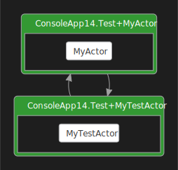

## Integrate Coyote with a unit testing framework

Common unit testing frameworks like
[MSTest](https://docs.microsoft.com/en-us/dotnet/core/testing/unit-testing-with-mstest),
[xUnit.net](https://xunit.net/) and [nunit](https://nunit.org/) cannot easily call the `coyote`
command line tool for testing. In this case you can use the Coyote `TestingEngine` directly.

The Coyote `TestingEngine` is included in the `Microsoft.Coyote.Test` package. The following shows
a complete example using xUnit. The project simply includes xUnit and the Coyote packages:

```xml
<Project Sdk="Microsoft.NET.Sdk">
  <PropertyGroup>
    <TargetFramework>net5.0</TargetFramework>
  </PropertyGroup>
  <ItemGroup>
    <PackageReference Include="Microsoft.Coyote" Version="1.2.1" />
    <PackageReference Include="Microsoft.Coyote.Test" Version="1.2.1" />
    <PackageReference Include="xunit" Version="2.4.1" />
    <PackageReference Include="xunit.runner.visualstudio" Version="2.4.2">
      <PrivateAssets>all</PrivateAssets>
      <IncludeAssets>runtime; build; native; contentfiles; analyzers; 
                     buildtransitive</IncludeAssets>
    </PackageReference>
  </ItemGroup>
</Project>
```

And then your `[Fact]` method which runs as an xUnit unit test can create a `TestingEngine` to run a
Coyote test method.  This test code can run in the Visual Studio Test Explorer or from a `dotnet
test` command line:

```csharp
public class Test
{
    ITestOutputHelper Output;

    public Test(ITestOutputHelper output)
    {
        this.Output = output;
    }


    [Fact(Timeout = 5000)]
    public void RunCoyoteTest()
    {
        var config = Configuration.Create();
        TestingEngine engine = TestingEngine.Create(config, CoyoteTestMethod);
        engine.Run();
        var report = engine.TestReport;
        Output.WriteLine("Coyote found {0} bug.", report.NumOfFoundBugs);
        Assert.True(report.NumOfFoundBugs == 0, $"Coyote found {report.NumOfFoundBugs} bug(s).");
    }

    private async Task CoyoteTestMethod()
    {
        // This is running as a Coyote test.
        await Task.Delay(10);
        Specification.Assert(false, "This test failed!");
    }
}
```

This will produce the following test output because the `Specification.Assert` is hard wired to
fail.

```plain
Coyote found 1 bug.
```

Most of the command line options you see on `coyote test` are available in the `Configuration`
class. Use the `With*` helper methods to set the various configurations, for example, to specify
`--sch-pct 10` use the following:

```csharp
var config = Configuration.Create().WithPCTStrategy(false, 10);
```

For `--iterations` use `WithTestingIterations`. The `--graph` option maps to the `Configuration`
method `WithDgmlGraphEnabled`, while the `--coverage` option maps to `WithActivityCoverageEnabled`.
The `--xml-trace` option becomes `WithXmlLogEnabled` and so on.

If you want the rich Coyote log files, you can use the `TryEmitTraces` method on the `TestingEngine`
to produce those log files in the folder of your choice like this:

```csharp
List<string> filenames = new List<string>(engine.TryEmitTraces("d:\\temp\\test", "mytest"));
foreach (var item in filenames)
{
    Output.WriteLine("See log file: {0}", item);
}
```

Note: `TryEmitTraces` is an iterator method, which means you must iterate the result in order to
produce the log files.  You will see the following output:
```plain
Coyote found 1 bugs
See log file: d:\temp\test\mytest_0.txt
See log file: d:\temp\test\mytest_0.schedule
```

And the log file contains the familiar output of `coyote test` as follows:

```xml
<TestLog> Running test.
<ErrorLog> This test failed!
<StackTrace>
at Microsoft.Coyote.SystematicTesting.OperationScheduler.NotifyAssertionFailure(
    String text, Boolean killTasks, Boolean cancelExecution)
   at Microsoft.Coyote.SystematicTesting.ControlledRuntime.Assert(Boolean predicate, String s)
   at ConsoleApp14.Test.CoyoteTestMethod()
   at System.Runtime.CompilerServices.AsyncMethodBuilderCore.Start[TStateMachine]()
   at ConsoleApp14.Test.CoyoteTestMethod()
   at Microsoft.Coyote.SystematicTesting.ControlledRuntime.RunTestb__0d.MoveNext()
   at System.Runtime.CompilerServices.AsyncMethodBuilderCore.Start[TStateMachine]()
   at Microsoft.Coyote.SystematicTesting.ControlledRuntime.RunTestb__0()
   at System.Threading.Tasks.Task.InnerInvoke()
   at System.Threading.Tasks.Task.c.cctorb__274_0(Object obj)
   at System.Threading.ExecutionContext.RunFromThreadPoolDispatchLoop(
       Thread threadPoolThread, ExecutionContext executionContext, ContextCallback callback)
   at System.Threading.Tasks.Task.ExecuteWithThreadLocal(Task currentTaskSlot)
   at System.Threading.Tasks.Task.ExecuteEntryUnsafe(Thread threadPoolThread)
   at System.Threading.Tasks.Task.ExecuteFromThreadPool(Thread threadPoolThread)
   at System.Threading.ThreadPoolWorkQueue.Dispatch()
   at System.Threading._ThreadPoolWaitCallback.PerformWaitCallback()

<TestLog> Exploration finished [found a bug using the 'random' strategy].
<StrategyLog> Testing statistics:
<StrategyLog> Found 1 bug.
<StrategyLog> Scheduling statistics:
<StrategyLog> Explored 1 schedule: 1 fair and 0 unfair.
<StrategyLog> Found 100.00% buggy schedules.
<StrategyLog> Number of scheduling points in fair terminating schedules: 
              3 (min), 3 (avg), 3 (max).
```

The `TestEngine.Create` method has overloads for supporting Coyote test methods with
the following signatures:

```csharp
Action
Action<ICoyoteRuntime>
Action<IActorRuntime>
Func<Task>
Func<ICoyoteRuntime, Task>
Func<IActorRuntime, Task>
```

Notice that you never create an `ICoyoteRuntime` or `IActorRuntime` yourself, the `TestingEngine`
will do that for you so it can provide the non-production systematic test version of those runtimes.

## Replaying a trace

You can also easily replay and debug a trace, similar to using `coyote replay` from the command line
tool. To do this you need to configure the `TestingEngine` to run in replay mode:
```csharp
var trace = ...
var config = Configuration.Create().WithReplayStrategy(trace);
```
The input to the `WithReplayStrategy` method should either be the contents of a `.schedule` file or
the `string` value of `TestingEngine.ReproducibleTrace` (from a previous run).

Then you add breakpoints to debug and replay as follows:

```csharp
var trace = ...
var config = Configuration.Create().WithReplayStrategy(trace);
TestingEngine engine = TestingEngine.Create(config, CoyoteTestMethod);
engine.Run();
```

## Testing actors

Actors run asynchronously, so you will need to design your actors in a way such that you know when
they have finished doing what they are supposed to do. One way to do that is to use the Coyote
`TaskCompletionSource<bool>` as follows:

```csharp
class TestConfigEvent : Event
{
    public TaskCompletionSource<bool> Completed = TaskCompletionSource.Create<bool>();
}

private async Task CoyoteTestActors(IActorRuntime runtime)
{
    // this method can be run by the Coyote TestingEngine.
    TestConfigEvent config = new TestConfigEvent();
    runtime.CreateActor(typeof(MyTestActor), config);
    await config.Completed.Task;
    Output.WriteLine("Coyote actor test passed");
}
```

Where `MyTestActor` sets the result on the `TaskCompletionSource` as follows:

```csharp
[OnEventDoAction(typeof(MyEvent), nameof(HandleEvent))]
class MyTestActor : Actor
{
    TestConfigEvent config;

    protected override System.Threading.Tasks.Task OnInitializeAsync(Event initialEvent)
    {
        config = (TestConfigEvent)initialEvent;
        var actor = this.CreateActor(typeof(MyActor));
        this.SendEvent(actor, new MyEvent() { Caller = this.Id });

        return base.OnInitializeAsync(initialEvent);
    }

    private void HandleEvent(Event e)
    {
        config.Completed.SetResult(true);
    }
}
```

This test actor creates `MyActor`, sends an event to it, waits for a response, then sets
the `TaskCompletionSource` result.  `MyActor` is a simple ping-pong style actor:

```csharp
class MyEvent : Event
{
    public ActorId Caller;
}

[OnEventDoAction(typeof(MyEvent), nameof(HandleEvent))]
class MyActor : Actor
{
    private void HandleEvent(Event e)
    {
        ActorId caller = ((MyEvent)e).Caller;
        this.SendEvent(caller, new MyEvent() { Caller = this.Id });
    }
}
```

If you run this test setting `WithXmlLogEnabled(true)` on the `Configuration` you will get the
following [DGML diagram](generate-dgml.md) showing you what happened during this test:



See the following API documentation for more information:

- [TestingEngine](../ref/Microsoft.Coyote.SystematicTesting/TestingEngine.md)
- [TestReport](../ref/Microsoft.Coyote.SystematicTesting/TestReport.md)
- [Configuration](../ref/Microsoft.Coyote/Configuration.md)
