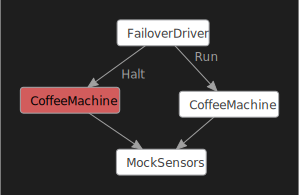
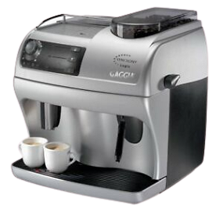
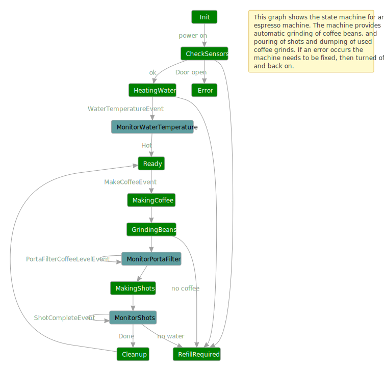

## Test failover and liveness in Coyote actors

*Wikipedia* provides this [definition](https://en.wikipedia.org/wiki/Failover): "**Failover** is
switching to a redundant or standby computer server, system, hardware component or network upon the
failure or abnormal termination of the previously active application, server, system, hardware
component, or network. Systems designers usually provide failover capability in servers, systems or
networks requiring near-continuous availability and a high degree of reliability."

This sample applies the failover concept to the firmware of an automated espresso machine using the
Coyote [asynchronous actors](../../concepts/actors/overview.md) programming model. Imagine what
would happen if the tiny CPU running the machine rebooted in the middle of making a coffee. What
bad things might happen? Can we design a state machine that can handle this scenario and provide a
more fault tolerant coffee machine?

An identical version of this tutorial is available that uses [regular C# tasks](../test-failover.md).

The following diagram shows how Coyote can be used to test this scenario and help you design more
reliable software.



The `CoffeeMachine` is modeled as an asynchronous [state
machine](../../concepts/actors/state-machines.md). This example is not providing real firmware,
instead it `mocks` the hardware sensor platform built into the machine. This is done in
`MockSensors.cs` where you will find three actors that model various hardware components:
`MockDoorSensor`, `MockWaterTank` and `MockCoffeeGrinder`. This actor provides async ways of reading
sensor values like Water temperature and water levels, or turning on and off the coffee grinder and
so on.  The `CoffeeMachine` does not know the sensors are mocks, all it knows is the public
interface defined in `SensorEvents.cs`.  In this way the `CoffeeMachine` is production code, while
the mocks are only for testing.

The reason we are using an asynchronous model is that even in the smallest of devices, often times
there is a message passing architecture where different hardware components are connected via some
sort of bus, whether it is a simple serial port, or something more sophisticated like a [CAN
bus](https://en.wikipedia.org/wiki/CAN_bus).

We will test that we can kill the `CoffeeMachine` and restart it without anything bad happening.
This test is setup by the `FailoverDriver`. The FailoverDriver lets the first `CoffeeMachine`
instance run for a bit then it randomly kills it by using the `HaltEvent`, then it starts a new
`CoffeeMachine`. The new `CoffeeMachine` instance needs to figure out the state of the sensors such
that when a `MakeCoffeeEvent` arrives, it doesn't do something silly that breaks the machine. The
mock sensors are not killed so that it acts as a persistent store for sensor state across all
instances of the `CoffeeMachine`.

Some safety `Asserts` are placed in the code that verify certain important things, including:
- do not turn on heater if there is no water
- do not turn on grinder if there are no beans in the hopper
- do not turn on shot maker if there is no water
- do not do anything if the door is open

There is also a correctness assert in the `CoffeeMachine` to make sure the correct number of
espresso shots are made and there is a `LivenessMonitor` that monitors the `CoffeeMachine` to make
sure it never gets stuck, i.e., it always finishes the job it was given or it goes to an error state
if the machine needs to be fixed. See [Liveness Checking](../../how-to/liveness-checking.md).

A number of excellent bugs were found by Coyote during the development of this sample, and this
illustrates the fact that Coyote can be applied to any type of asynchronous software, not just cloud
services. There is still one bug remaining in the code which you can find using `coyote test`, and
it happens after failover just to prove the usefulness of this testing methodology.

## What you will need

To run the `CoffeeMachine` example, you will need to:

- Install [Visual Studio 2019](https://visualstudio.microsoft.com/downloads/).
- Install the [.NET 5.0 version of the coyote tool](../../get-started/install.md).
- Clone the [Coyote Samples git repo](http://github.com/microsoft/coyote-samples).
- Be familiar with the `coyote` tool. See [Testing](../../get-started/using-coyote.md).

## Build the samples

Build the `coyote-samples` repo by running the following command:

```plain
powershell -f build.ps1
```

## Run the failover coffee machine application

Now you can run the `CoffeeMachine` application:

```plain
"./bin/net5.0/CoffeeMachineActors.exe"
```

## The coffee machine

There are many different types of coffee machines. This example is based on the following machine
which can automatically heat water, grind beans, and make an espresso shot all with the press of a
button:



The following diagram shows the states and actions in our example implementation in the
`CoffeeMachine` class:



When you run the executable without using `coyote test` (this is called running in `production
mode`), you will see the following console output. Notice in the output below that the
`FailoverDriver` forces the termination of the `CoffeeMachine` right in the middle of making a
coffee. Then when the `CoffeeMachine` is restarted, the `FailoverDriver` requests another coffee
and the `CoffeeMachine` is able to continue on, the water is already warm, and it dumps the old
grinds so you have the freshest possible coffee each time.

```xml
<FailoverDriver> starting new CoffeeMachine.
<CoffeeMachine> initializing...
<CoffeeMachine> checking initial state of sensors...
<CoffeeMachine> Water level is 60 %
<CoffeeMachine> Hopper level is 93 %
<CoffeeMachine> Warming the water to 100 degrees
<CoffeeMachine> Turning on the water heater
<CoffeeMachine> Coffee machine is warming up (64 degrees)...
<CoffeeMachine> Coffee machine is warming up (74 degrees)...
<CoffeeMachine> Coffee machine is warming up (84 degrees)...
<CoffeeMachine> Coffee machine is warming up (94 degrees)...
<CoffeeMachine> Coffee machine water temperature is now 100
<CoffeeMachine> Turning off the water heater
<CoffeeMachine> Coffee machine is ready to make coffee (green light is on)
<CoffeeMachine> Coffee requested, shots=1
<CoffeeMachine> Grinding beans...
<CoffeeMachine> PortaFilter is 10 % full
<CoffeeMachine> PortaFilter is 20 % full
<CoffeeMachine> PortaFilter is 30 % full
<CoffeeMachine> PortaFilter is 40 % full
<CoffeeMachine> PortaFilter is 50 % full
<CoffeeMachine> PortaFilter is 60 % full
<CoffeeMachine> PortaFilter is 70 % full
<CoffeeMachine> PortaFilter is 80 % full
<CoffeeMachine> PortaFilter is 90 % full
<CoffeeMachine> PortaFilter is full
<CoffeeMachine> Making shots...
<FailoverDriver> forcing termination of CoffeeMachine.
<CoffeeMachine> Coffee Machine Terminating...
<CoffeeMachine> #################################################################
<CoffeeMachine> # Coffee Machine Halted                                         #
<CoffeeMachine> #################################################################

<FailoverDriver> starting new CoffeeMachine.
<CoffeeMachine> initializing...
<CoffeeMachine> checking initial state of sensors...
<CoffeeMachine> Water level is 60 %
<CoffeeMachine> Hopper level is 83 %
<CoffeeMachine> Dumping old smelly grinds!
<CoffeeMachine> Warming the water to 100 degrees
<CoffeeMachine> Coffee machine water temperature is now 100
<CoffeeMachine> Coffee machine is ready to make coffee (green light is on)
<CoffeeMachine> Coffee requested, shots=2
<CoffeeMachine> Grinding beans...
<CoffeeMachine> PortaFilter is 10 % full
<CoffeeMachine> PortaFilter is 20 % full
<CoffeeMachine> PortaFilter is 30 % full
<CoffeeMachine> PortaFilter is 40 % full
<CoffeeMachine> PortaFilter is 50 % full
<CoffeeMachine> PortaFilter is 60 % full
<CoffeeMachine> PortaFilter is 70 % full
<CoffeeMachine> PortaFilter is 80 % full
<CoffeeMachine> PortaFilter is 90 % full
<CoffeeMachine> PortaFilter is full
<CoffeeMachine> Making shots...
<CoffeeMachine> Shot count is 1
<CoffeeMachine> 2 shots completed and 2 shots requested!
<CoffeeMachine> Dumping the grinds!
<CoffeeMachine> Coffee machine is ready to make coffee (green light is on)
<FailoverDriver> CoffeeMachine completed the job.
...
```

The test will continue on making coffee until it runs out of either water or coffee beans and the
`FailoverDriver` halts each `CoffeeMachine` instance at random times until the machine is out of
resources, at which point the test is complete. The mock sensors also randomly choose some error
conditions, so instead of the above you may see some errors like:

```xml
<CoffeeMachine> Cannot safely operate coffee machine with the door open!
<CoffeeMachine> Coffee machine needs manual refilling of water and/or coffee beans!
```

If you see these errors, press ENTER to terminate the program and run it again. These random start
conditions help the test cover more cases.

Each halted machine is terminated and discarded, then a new `CoffeeMachine` instance is started that
must figure out what is happening with the sensors and make the next coffee without incident.
Eventually a `CoffeeMachine` will report there is no more water or coffee beans and then it will
stop with an error message saying the machine needs to be manually refilled.

### Coyote testing

You can now use [coyote test](../../get-started/using-coyote.md) to exercise the code and see if any bugs
can be found. From the `coyote-samples` folder:

```plain
coyote test ./bin/net5.0/CoffeeMachineActors.dll -i 100 -ms 2000 --sch-pct 10 --graph-bug
```

Chances are this will find a bug quickly, one of the safety assertions will fire and you will see
that a test output log and [DGML diagram](../../how-to/generate-dgml.md) are produced, like this:

```plain
.\bin\net5.0\Output\CoffeeMachineActors.exe\CoyoteOutput\CoffeeMachine_0_0.txt
.\bin\net5.0\Output\CoffeeMachineActors.exe\CoyoteOutput\CoffeeMachine_0_0.dgml
```

This log can be pretty big, a couple thousand lines where each line represents one async operation.
This log contains only the one iteration that failed, and towards the end you will see something
like this:

```plain
<ActionLog> Microsoft.Coyote.Samples.CoffeeMachineActors.MockCoffeeGrinder(3) invoked action 'OnGrinderButton'.
<ErrorLog> Please do not turn on grinder if there are no beans in the hopper
```

So the `CoffeeMachine` accidentally tried to grind beans when the hopper was empty. If you look at
the resulting DGML diagram you will see exactly what happened:

<div class="animated_svg" trace="../../assets/data/CoffeeMachine.trace.xml"
     svg="../../assets/images/FailoverCoffeeMachineBug.svg">
</div>


The `Timer` machines were removed from this diagram just for simplicity. The `FailoverDriver`
started the first `CoffeeMachine` on the left which ran to completion but it ran low on coffee
beans. Then this first machine was halted. The `FailoverDriver` then started a new `CoffeeMachine`,
which made it all the way to `GrindingBeans` where it tripped the safety assertion in `MockCoffeeGrinder`.
So the bug here is that somehow, the second `CoffeeMachine` instance missed the fact that it was low
on coffee beans. A bug exists in the code somewhere. Can you find it?

It is not a trivial bug because the `CheckSensors` state is clearly checking the coffee level by
sending the `ReadHopperLevelEvent` to the `MockCoffeeGrinder` actor and `CheckInitialState` does not
advance to the `HeatingWater` state until this reading is returned. So what happened?

Hint: if you search backwards in the output log you will find the following situation reported in
`CheckState`:

```plain
<CoffeeMachine> Hopper level is -5 %
```

The first `CoffeeMachine` instance left the grinder running a bit too long, and the sensor got
confused thinking the coffee level is negative. The new `CoffeeMachine` instance never thought
about this situation and checked only:

```plain
if ((int)this.HopperLevel.Value == 0)
...
```

And so it missed the fact it might be negative. The fix is easy, just change this condition to `<=`
and the bug goes away. The fact that such a tricky bug was found so quickly shows the power of
using the Coyote state machine programming model together with the `coyote test` tool.

### Testing the scheduling of highly asynchronous operations

This raises a bigger design question, how did the coffee level become negative?  In firmware it is
common to poll sensor readings and do something based on that. In this case we are polling a
`PortaFilterCoffeeLevelEvent` in a tight loop while in the `GrindingBeans` state. Meanwhile the
`MockCoffeeGrinder` class has a [timer](../../concepts/actors/timers.md) running and when
`HandleTimer` calls `MonitorGrinder` it decreases the coffee level by 10 percent during every time
interval. So we have an asynchronous operation going on here. Coffee level is decreasing based on a
timer, and the `CoffeeMachine` is monitoring that coffee level using async events. This all seems
to work perfectly in the production code where we see this output:

```plain
<CoffeeMachine> Grinding beans...
<CoffeeMachine> PortaFilter is 10 % full
<CoffeeMachine> PortaFilter is 20 % full
<CoffeeMachine> PortaFilter is 30 % full
<CoffeeMachine> PortaFilter is 40 % full
<CoffeeMachine> PortaFilter is 50 % full
<CoffeeMachine> PortaFilter is 60 % full
<CoffeeMachine> PortaFilter is 70 % full
<CoffeeMachine> PortaFilter is 80 % full
<CoffeeMachine> PortaFilter is 90 % full
<CoffeeMachine> PortaFilter is full
```

And the reason it works is because your Operating System is scheduling both of these async threads
in a way that is relatively `fair` meaning one does not run for a long time without the other being
scheduled also. But what if these two systems were running in a distributed world and one of them
hangs for a long time? This is the kind of thread scheduling that `coyote test` is testing where one
machine can run way ahead of another.

You need to take this into account when using this kind of [timer based async
events](../../concepts/actors/timers.md). One way to improve the design in a firmware based
system like a coffee machine is to switch from a polling based system to an interrupt based system
where the `MockCoffeeGrinder` can send important events to the `CoffeeMachine`. This style of interrupt
based eventing is used to model the `ShotCompleteEvent`, `WaterHotEvent`, `WaterEmptyEvent` and
`HopperEmptyEvent`.

This shows how Coyote can help find actual design flaws in your code so you can design a system that
is more robust in the face of unexpected faults. The `coyote test` engine provides several
different `scheduling strategies` that test different kinds of fairness algorithms. These are
designed to find different kinds of bugs. The following command line shows how to use
`--sch-portfolio` and the `--parallel` options to test a bunch of different strategies in parallel,
each in different test processes:

```plain
coyote test ./bin/net5.0/CoffeeMachineActors.dll -i 100 -ms 2000 --sch-pct 10 --graph-bug --sch-portfolio --parallel 8
```

which outputs the following:
```plain
. Testing .\bin\net5.0\CoffeeMachineActors.dll
Starting TestingProcessScheduler in process 42036
... Created '8' testing tasks.
... Task 3 is using 'FairPCT' strategy (seed:2143).
... Task 5 is using 'FairPCT' strategy (seed:3489).
... Task 2 is using 'ProbabilisticRandom' strategy (seed:1470).
... Task 7 is using 'FairPCT' strategy (seed:4835).
... Task 0 is using 'Random' strategy (seed:124).
... Task 6 is using 'ProbabilisticRandom' strategy (seed:4162).
... Task 4 is using 'ProbabilisticRandom' strategy (seed:2816).
... Task 1 is using 'FairPCT' strategy (seed:797).
...
```

The `--parallel 8` option means use 8 test processes in parallel with each one being assigned a
random scheduling strategy. Each process runs until the first bug is found by some process, then
they are all terminated and the bug is reported. This can be useful when you want to leverage the
full power of your computer to find those bugs that are particularly hard to find more quickly.

You can find out how much testing was actually done during this parallel test operation by adding
`--coverage activity`. The [coverage report](../../how-to/coverage.md) summarizes how many
of the possible events were covered.

### Liveness monitor

As described in the documentation on [Liveness Checking](../../how-to/liveness-checking.md) the
`CoffeeMachine` must also eventually `finish` what it is doing. It must either make a coffee when
requested and return to the `Ready` state, or it must find a problem and go to the `Error` state or
the `RefillRequired` state. This "liveness" property can be enforced using a very simple
`LivenessMonitor` as shown below:

```c#
internal class LivenessMonitor : Monitor
{
    public class BusyEvent : Event { }

    public class IdleEvent : Event { }

    [Start]
    [Cold]
    [OnEventGotoState(typeof(BusyEvent), typeof(Busy))]
    [IgnoreEvents(typeof(IdleEvent))]
    private class Idle : State { }

    [Hot]
    [OnEventGotoState(typeof(IdleEvent), typeof(Idle))]
    [IgnoreEvents(typeof(BusyEvent))]
    private class Busy : State { }
}
```

This type of `Monitor` is also a kind of state machine. The `CoffeeMachine` can send events to this
monitor to tell it when it has switched into `Busy` state or `Idle` state. When the `CoffeeMachine`
starts heating water, or making coffee it sends this event:

```c#
this.Monitor<LivenessMonitor>(new LivenessMonitor.BusyEvent());
```

and when the CoffeeMachine is done making coffee or it has moved to an error state it sends this
event:

```c#
this.Monitor<LivenessMonitor>(new LivenessMonitor.IdleEvent());
```

The `Busy` state is marked as a `[Hot]` state and the `Idle` state is marked as a `[Cold]` state.
During testing if `coyote test` finds the `LivenessMonitor` to be stuck in the `[Hot]` state too
long it raises an exception and the test fails.

### Reliable termination handshake

You may notice in the code that when the `FailoverDriver` wants to stop the first `CoffeeMachine` it
sends a `CoffeeMachine.TerminateEvent` and waits for a `CoffeeMachine.HaltedEvent` before it starts
a new `CoffeeMachine` by running `this.RaiseGotoStateEvent<Test>()`.

This may seem a bit convoluted compared to just `this.SendEvent(this.CoffeeMachineId,
HaltEvent.Instance)` followed by `this.RaiseGotoStateEvent<Test>()`. The reason a direct halt event
was not used in this case is because a `HaltEvent` is processed asynchronously, which means the
`RaiseGotoStateEvent` would end up creating the new `CoffeeMachine` instance before the old one was
fully halted. This can lead to confusion in the mock sensors which are written to expect one
and only one client `CoffeeMachine` at a time. The `TerminateEvent` handshake solves that problem.

Since the `TerminateEvent` could be sent to the `CoffeeMachine` at any time we need an easy way to
handle this event at any time in `CoffeeMachine`, hopefully without having to decorate every single
state in the machine with the custom attribute:

```c#
[OnEventDoAction(typeof(TerminateEvent), nameof(OnTerminate))]
```

The solution is to promote this `OnEventDoAction` to the class level.  Class level handlers are
handled like a fall back mechanism so that no matter what state the `CoffeeMachine` is in the class
level handler can be invoked, unless the current state overrides that handler.

## Summary

Failover testing is simple to achieve using Coyote and yields many interesting bugs in your code,
including some thought-provoking design bugs. The technique of halting your "production"
actors/state-machines, and recreating them by reading from a "persistent" mock (which is not halted
during testing) can be generalized to many other scenarios (e.g. cloud services) where someone needs
to test failover logic of production actors using Coyote.

In this tutorial you learned:

1. How to do failover testing using Coyote `FailoverDriver` state machines.
2. How to use Coyote in a firmware/sensor scenario.
3. How to use `--sch-portfolio` testing on multiple processes to find tricky bugs more quickly.
4. How `Assert` helps find violations of safety properties during testing.
5. How to ensure full termination of one state machine before creating a new one.
6. How to use class level event handlers in a `StateMachine` to define an event handler
in one place that is invoked no matter what state the machine is in.
7. How to write a `LivenessMonitor`.
